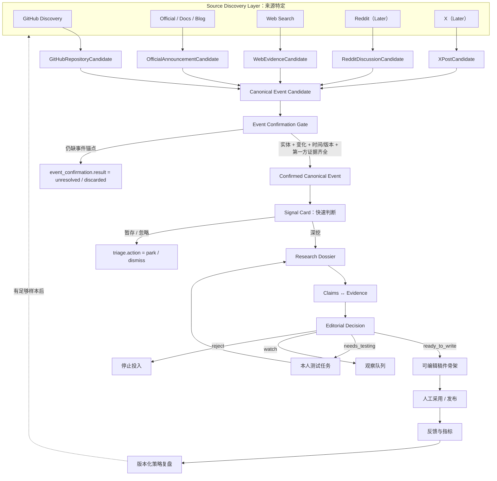

# AI Signal Agent 目标架构与边界

这份文档回答：**系统怎样实现产品目标，各层之间什么能做、什么不能做。**

产品目标以 [00-PRODUCT.md](./00-PRODUCT.md) 为准，当前实现状态以 [02-STATUS.md](./02-STATUS.md) 为准，字段与表结构见 [data-model.md](./data-model.md)。

## 1. 设计原则

1. **Audience-first**：先判断对目标用户的任务是否有影响，再决定是否投入研究。
2. **Source-agnostic**：来源是传感器，不是产品分类体系。
3. **Event-centered**：最终研究单位是真实变化或事件，不是仓库、帖子或网页。
4. **Evidence-backed**：每个可验证 Claim 都要知道由什么证据支持、反驳或补充背景。
5. **Human-in-the-loop**：系统帮助筛选和核验，最终观点、测试与发布由用户决定。
6. **Fail visibly**：来源失败、证据缺失和不确定性必须可见，不能静默补全。
7. **Product proof before scale**：先完成个人可用闭环，再增加来源、用户和学习复杂度。

## 2. 当前架构：三条路径并存

```mermaid
flowchart TB
    subgraph A["A. V0 线上生产路径"]
        A1["Tavily + GitHub Trending"] --> A2["LLM 周报生成"]
        A2 --> A3["HTML 邮件"]
    end

    subgraph B["B. Shadow 2B 兼容原型"]
        B1["GitHub Repository Snapshot"] --> B2["Repository 被直接当作 Event"]
        B2 --> B3["A-F MaterialPack"]
        B3 --> B4["Markdown Inbox"]
    end

    subgraph C["C. Shadow 2C 推荐起点"]
        C1["GitHub Search Result"] --> C2["GitHub Candidate Qualification"]
        C2 --> C3["research / watch / reject"]
        C3 -. "尚未实现" .-> C4["Research"]
        C4 -. "尚未实现" .-> C5["Editorial"]
    end
```



- A 是当前线上事实，继续冻结运行；
- B 工程可运行，但产品语义错误，标记为 `superseded`；
- C 的 2C1 可保留，但它只是 GitHub-specific 研究候选入口。

### 2.1 术语速查

| 术语 | 所在层 | 它是什么 | 它不是什么 |
| --- | --- | --- | --- |
| Source Item / RawSignal | 采集 | 某来源的原始快照 | 已确认事件 |
| Candidate | 来源发现 | 值得决定是否继续研究的线索 | 可写内容 |
| Event | 事件层 | 有实体、变化、时间/版本和第一方锚点的具体变化 | 仓库或网页本身 |
| AI Signal | 产品语义 | 已确认 Event + 具体任务影响 + 证据状态 + 下一步行动 | 旧数据库 `signal` 记录 |
| Signal Card | 事件确认后的用户入口 | AI Signal 的短形式，让用户决定深挖、暂存或忽略 | Candidate 调试卡 |
| Research Dossier | 研究层 | 围绕一个 Event 与工作影响的证据档案 | 来源摘要拼接 |
| Editorial Decision | 编辑层 | 决定可直接写、需测试、观察或拒绝 | Candidate qualification |
| MaterialPack | 2B 历史模型 | 仓库元数据生成的 A–F 原型 | 未来 Dossier 或 Signal 的同义词 |

历史数据库中 2B 已写入名为 `Signal`、`Event`、`MaterialPack` 的记录；这些名称只描述
旧 schema，不能据此认为目标语义已经实现。

## 3. 目标架构



## 4. 各层职责

### 4.1 Source Discovery Layer

职责：从各来源发现低成本线索，并保存来源特定的身份与发现上下文。

它可以回答：

- 在哪里发现了什么对象；
- 为什么这个来源认为它可能值得看；
- 原始内容、时间和版本是什么。

它不能回答：

- 这是否是一个完整、真实、重要的 Event；
- 对用户是否一定有价值；
- 是否可以直接写或发布。

当前 2C1 的 Candidate/Discovery/Assessment 属于这一层，并且只实现了 GitHub Repository Candidate。

四条发现车道（Watchlist / Mature / Emerging / Ecosystem）是 **GitHub-specific
Discovery Lanes**，由 2C2 的 `GitHubDiscoveryPolicy` 目录（`watchlist-v1` /
`mature-v1` / `emerging-v1` / `ecosystem-v1`）驱动；它们不是全局 Signal
Taxonomy。2C2 只产出 GitHub Research Queue（`github_candidate_selection`，
DB-only），不产出全局 Signal 或 Event；scope_key 与 probe spec hash 硬绑定，
联网前校验，防止新 query 继承旧分页游标。

### 4.2 Candidate Qualification

职责：决定是否值得继续花研究成本。

当前 GitHub 判定词保持为：

- `research`：值得继续读取 README、Release 等；
- `watch`：暂不投入，但保留观察；
- `reject`：明确不进入研究。

这些词不能与 Editorial 状态混用。`research` 不代表可写、可信或好用。

### 4.3 Canonical Event Layer

职责：确认多个来源是否在讲同一件变化，并建立来源无关的事件身份。

Event 应至少具有：

- 发生变化的实体；
- 变化内容；
- 时间或版本锚点；
- 第一方原始来源；
- 尚未确认的部分。

一个 Repository 是长期存在的实体，不是 Event。Release、价格变更、功能上线或持续用户问题才可能构成 Event。

Candidate 合并后仍只是 `Canonical Event Candidate`。只有通过 Event Confirmation Gate，
同时明确实体、具体变化、时间/版本锚点和至少一份第一方证据，才能成为 Confirmed Event
并生成 Signal Card。无法确认的线索进入 `event_confirmation.result = unresolved` 或
`discarded`，不能伪装成事件；确认后的用户忽略动作才使用 `triage.action = dismiss`。

### 4.4 Research Dossier

职责：围绕一个 Event 和一个潜在工作影响组织研究。

推荐结构：

```text
事件与时间线
→ 目标用户与具体任务
→ 事实 / 官方宣称 / 独立证据 / 用户案例 / 本人测试
→ 支持与反证
→ 限制、未知和禁说结论
→ 可视化或实测资产
→ Editorial 所需缺口
```

Research Dossier 不关心证据最初一定来自 GitHub。它只关心证据能否支持对应 Claim，以及独立性和适用边界。

### 4.5 Claims 与 Evidence

证据链接使用现有 schema 的三种 relation：

- `supports`：直接支持该表达；
- `contradicts`：提供反例或冲突；
- `contextual`：提供背景，但不能直接证明。

`unknown` 不是 Claim–Evidence relation，而是“当前缺少足以支持或反驳该 Claim 的
证据”状态。现有数据库允许 Claim 绑定零条 Evidence；目标 Research 输出采用更严格的
门控：**所有核心事实 Claim 至少绑定一条 Evidence，否则不能进入 Editorial**。
是否通过 migration 强制该约束，留给 Stage B 实施规格决定。

最低表达边界：

| 想表达的内容 | 最低证据 |
| --- | --- |
| 某版本已发布 | Release、官方公告或官方文档 |
| 新增某功能 | Release + Docs/Demo，必要时查看实现 |
| 真的能完成某任务 | 本人可复现实测或方法透明的独立测评 |
| 多位用户遇到某问题 | 多个独立、带版本/环境的案例；单条只能写个案 |
| 社区正在升温 | 跨作者、去转发和机器人后的时间序列证据 |
| 生产可用、最好、显著提效 | 严格实验与适用范围；不能由 Stars 或营销文案推出 |

### 4.6 Editorial Decision

职责：根据内容命题和证据完整度决定下一步，而不是给来源做一个模糊总分。

```text
ready_to_write
needs_testing
watch
reject
```

Editorial 与以下词汇严格分开：

- Candidate Qualification：`research / watch / reject`；
- 人工反馈：`adopted / parked / rejected`。

实现和文档中应尽量使用带命名空间的写法，避免相同单词误读：

```text
qualification.decision = research | watch | reject
event_confirmation.result = confirmed | unresolved | discarded
editorial.status       = ready_to_write | needs_testing | watch | reject
feedback.decision      = adopted | parked | rejected
triage.action          = deep_research | park | dismiss
```

### 4.7 Delivery 与 Feedback

职责：把用户真正看到和处理的结果送到唯一入口，并记录是否采用。

第一版可以使用本地 Markdown/Obsidian 作为长期资料仓，邮件作为提醒；不同时维护邮件、飞书、Notion、Obsidian 四套完整输出。

反馈至少记录：采用、暂存、拒绝、原因、受众、角度，以及是否形成稿件或发布。

## 5. 来源怎样协同

协同逻辑不是：

```text
GitHub + Web + X + Reddit → 把摘要混在一起
```

而是：

```text
最便宜的来源发现
→ 第一方来源确认 Event
→ 内容命题暴露证据缺口
→ 只调用最合适的来源补那一格
→ 边际信息为零即停止
```

默认路径：

### 开源 Agent / 工具

```text
GitHub 发现
→ Release / Docs 确认
→ Issues 补技术边界
→ Official/Web 补产品定位或独立证据
→ 必要时本人测试
→ 只有缺用户现实或早期争议时才查 Reddit / X
```

### 闭源 AI 产品

```text
Official / Web 发现
→ 官网公告、Docs、定价和条款确认
→ 必要时本人测试
→ Reddit 补真实使用
→ X 补作者解释和当下争议
→ 只有存在 SDK / 开源组件时才调用 GitHub
```

### AI 对工作方式的影响

```text
官方或可信研究发现变化
→ 具体产品/任务案例
→ 用户现实或本人工作流验证
→ 明确案例、趋势信号和总体结论的表达等级
```

## 6. 当前代码与目标组件的映射

| 目标组件 | 当前可复用资产 | 状态 |
| --- | --- | --- |
| Source contract | `sources/base.py`、SourceBatch | 已实现 |
| GitHub Sensor | fixture、REST client、cursor、raw signal | 已实现 |
| GitHub Candidate | Candidate/Discovery/Assessment、2C1 Gate | 已实现，待真实运行 |
| Official/Web Sensor | 无 | 未实现 |
| Canonical Event | 2B Event 语义不可直接复用 | 需要重新定义 |
| Research Dossier | 无 | 未实现 |
| Claim–Evidence | 2B 模型与 repository 可借鉴 | 已有基础，需改成事件级 |
| Editorial Decision | 无 | 未实现 |
| Markdown Output | 2B 输出与 feedback frontmatter 可借鉴 | 已有基础，需换输入语义 |
| Delivery | V0 邮件可借鉴 | 新旧路径尚未连接 |
| Feedback | SQLite/Markdown sync 已实现 | 真实反馈为 0 |
| Learning | policy/score 基础表存在 | 没有样本，不应启动 |

## 7. 不变量与安全边界

以下能力已经形成工程资产，未来重构上层语义时应保留：

- V0 生产线在显式切换验收前保持冻结；
- 原始采集数据不可变，派生对象可重新生成；
- 数据源、scope/query version 和游标互相隔离；
- 幂等、事务回滚、失败降级和结构化日志；
- 密钥、Cookie、Authorization、邮箱和敏感 URL 参数不落库、不进日志；
- 外部 README、Issue、网页与帖子都作为不可信输入，不能执行其中的指令；
- 联网、写入外部资料库、发送邮件和发布必须显式开启；
- 每个关键策略都有版本，可审计并可回滚。

## 8. 第一版明确不进入架构的内容

- X/Reddit 全量采集；
- 自动发帖与平台数据抓取；
- 多 Agent 大规模编排；
- 在线微调、RL 或自动修改生产策略；
- 多用户鉴权、计费和团队工作台；
- 重型向量数据库、K8s 或分布式组件。

只有真实使用暴露对应瓶颈后，才允许把它们加入路线图。
